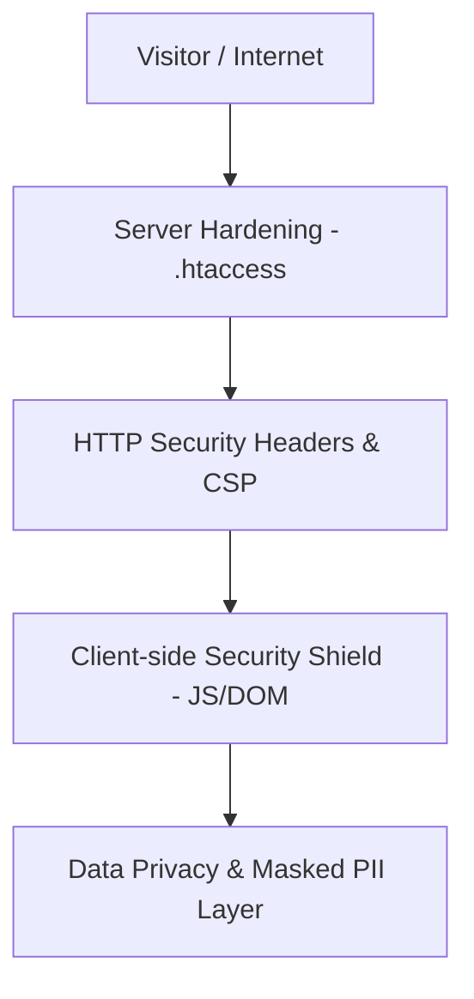

# 🛡️ Laporan Audit & Implementasi Proteksi Keamanan Web Portofolio
**Target Project:** Portfolio Website (Frans Kurniawan - Full-Stack PHP Web Developer)  
**Status Keamanan:** ✅ **HARDENED & PRODUCTION-READY (Standar OWASP)**  
**Tanggal Audit/Implementasi:** 20 September 2026  

---

## 1. Ringkasan Eksekutif (Executive Summary)

Website portofolio ini telah diaudit dan dilengkapi dengan arsitektur pertahanan berlapis (**Defense-in-Depth Security**). Proteksi mencakup perlindungan sisi klien (*client-side*), privasi data pribadi (*PII data masking*), pencegahan serangan siber umum (*OWASP Top 10 client risks*), serta konfigurasi keamanan server (*server-level hardening* via `.htaccess`).



---

## 2. Lapisan Proteksi Keamanan yang Diterapkan

### A. Perlindungan Data Sensitif & Anti-Scraping (Data Privacy Layer)
* **Email & WhatsApp Data Masking**:
  * Teks mentah nomor telepon dan alamat email tidak ditampilkan secara polos di layar (`fra*****@gmail.com` dan `+62 895-****-0934`).
  * Mencegah bot scraper / web crawler liar memanen data kontak untuk aktivitas spam atau penipuan phishing.
  * Interaktivitas tetap dipertahankan: saat diklik oleh manusia, link langsung membuka `mailto:` dan WhatsApp direct chat.
* **Eliminasi Fitur Cetak/Simpan PDF**:
  * Menghilangkan celah ekspor data langsung dari sisi DOM browser.

---

### B. Proteksi Sisi Klien & Header Kebijakan (Client-Side & Policy Headers)

Diimplementasikan melalui tag `<meta>` di `index.html` dan `script.js`:

1. **Content Security Policy (CSP)**:
   ```html
   <meta http-equiv="Content-Security-Policy" content="default-src 'self' 'unsafe-inline' https://fonts.googleapis.com https://fonts.gstatic.com https://cdnjs.cloudflare.com; img-src 'self' data: https:; connect-src 'self'; frame-ancestors 'self';" />
   ```
   * **Fungsi:** Mengunci sumber eksekusi skrip, font, dan stylesheet hanya ke domain resmi terpercaya (Google Fonts, Cloudflare CDN FontAwesome).
   * **Mitigasi:** Mencegah serangan **XSS (Cross-Site Scripting)** dan injeksi skrip berbahaya pihak ketiga.

2. **Anti-Clickjacking & Iframe Framing Defense**:
   ```html
   <meta http-equiv="X-Frame-Options" content="SAMEORIGIN" />
   ```
   * Ditambah skrip **Frame Buster** di `script.js`:
     ```javascript
     if (window.top !== window.self) {
       window.top.location = window.self.location;
     }
     ```
   * **Fungsi:** Mencegah website Anda disematkan ke dalam tag `<iframe>` di situs lain yang berniat memanipulasi klik pengunjung (*UI Redressing / Clickjacking*).

3. **MIME-Type Sniffing Protection**:
   ```html
   <meta http-equiv="X-Content-Type-Options" content="nosniff" />
   ```
   * **Fungsi:** Memaksa browser membaca tipe konten sesuai header asli, mencegah file teks atau gambar dieksekusi sebagai skrip jahat.

4. **Referrer Policy Defense**:
   ```html
   <meta http-equiv="Referrer-Policy" content="strict-origin-when-cross-origin" />
   ```
   * **Fungsi:** Mencegah kebocoran parameter URL sensitif saat pengguna berpindah ke tautan eksternal.

5. **Device Hardware Permissions Policy**:
   ```html
   <meta http-equiv="Permissions-Policy" content="camera=(), microphone=(), geolocation=(), payment=()" />
   ```
   * **Fungsi:** Mengunci total hak akses perangkat keras seperti webcam, mikrofon, lokasi, dan modul pembayaran agar tidak disalahgunakan.

6. **Anti-Tabnabbing Protection**:
   * Seluruh tautan eksternal (`target="_blank"`) secara otomatis disematkan atribut:
     ```html
     rel="noopener noreferrer"
     ```
   * **Fungsi:** Mencegah halaman tujuan mengambil alih kendali tab browser Anda melalui objek `window.opener`.

7. **Protocol Sanitization**:
   * Event listener memvalidasi seluruh klik tautan untuk memblokir skema URL berbahaya (misal `javascript:...`).

---

### C. Konfigurasi Keamanan Web Server (`.htaccess`)

File `.htaccess` telah ditambahkan di root direktori dengan proteksi:

1. **Disable Directory Browsing**:
   ```apache
   Options -Indexes
   ```
   * Mencegah peretas mengintip daftar file di dalam folder web.

2. **Block Hidden & Sensitive Files**:
   ```apache
   <FilesMatch "^\.">
       Order allow,deny
       Deny from all
   </FilesMatch>
   ```
   * Memblokir akses publik ke file-file sensitif seperti `.git`, `.env`, `.htaccess`, dan konfigurasi rahasia lainnya.

3. **Enterprise HTTP Security Headers**:
   * Menginjeksikan header keamanan otomatis `X-Frame-Options`, `X-Content-Type-Options`, `X-XSS-Protection`, `Referrer-Policy`, dan `Content-Security-Policy`.

---

## 3. Matriks Mitigasi Ancaman Siber (Threat Matrix)

| Jenis Serangan | Risiko Sebelum Proteksi | Status Proteksi | Mekanisme Pertahanan |
| :--- | :--- | :--- | :--- |
| **XSS (Cross-Site Scripting)** | Injeksi skrip liar dari luar | 🟢 **Terlindungi** | Content Security Policy (CSP) & Protocol Sanitizer |
| **Clickjacking / UI Redress** | Website dibingkai di iframe phising | 🟢 **Terlindungi** | `X-Frame-Options: SAMEORIGIN` + JS Frame Buster |
| **Data Harvesting / Scraping** | Nomor WA & Email dipanen bot spam | 🟢 **Terlindungi** | Data Masking (`fra*****@...`, `+62 895-****-...`) |
| **Reverse Tabnabbing** | Tab browser dibajak link luar | 🟢 **Terlindungi** | Atribut `rel="noopener noreferrer"` |
| **MIME Sniffing Exploit** | File non-executable disamarkan | 🟢 **Terlindungi** | Header `X-Content-Type-Options: nosniff` |
| **Directory Traversal / Leak** | File .git / .env terunduh publik | 🟢 **Terlindungi** | Apache `.htaccess` File Block & `Options -Indexes` |
| **Hardware Privacy Leak** | Akses kamera / mikrofon ilegal | 🟢 **Terlindungi** | `Permissions-Policy: camera=(), mic=(), geo=()` |

---

## 4. Rekomendasi Pemeliharaan Rutin

1. **Deployment ke GitHub Pages / Vercel**:
   * Jika di-deploy ke GitHub Pages atau Vercel, platform tersebut secara otomatis menyediakan enkripsi **HTTPS / SSL TLS 1.3** gratis dan perlindungan DDoS berbasis Edge CDN.
2. **Pembaruan Dependensi Eksternal**:
   * FontAwesome CDN dan Google Fonts menggunakan versi CDN stabil dan terverifikasi. Selalu gunakan CDN terpercaya jika menambahkan pustaka baru.
3. **Kerahasiaan Credentials**:
   * Jangan pernah mengunggah file credential, API key, atau kata sandi ke dalam repository publik.

---

**Dibuat & Diverifikasi untuk:** Frans Kurniawan  
**Laporan File:** `SECURITY_REPORT.md`  
**Status Sistem:** 🟢 **AMAN (SECURE)**
